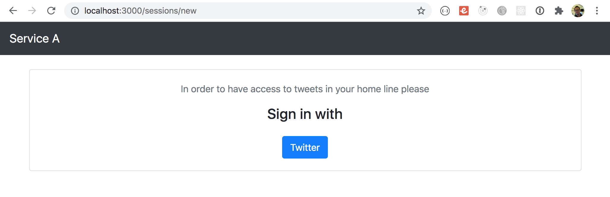
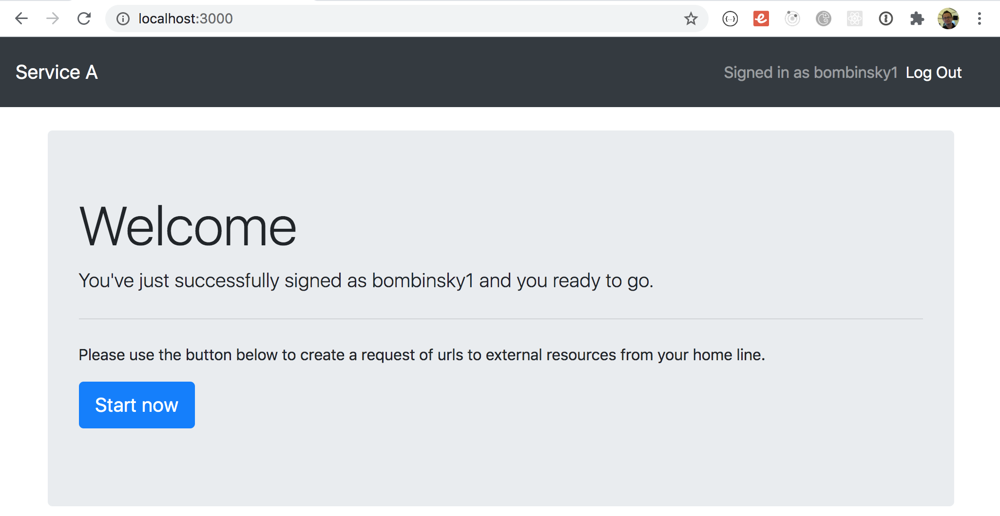
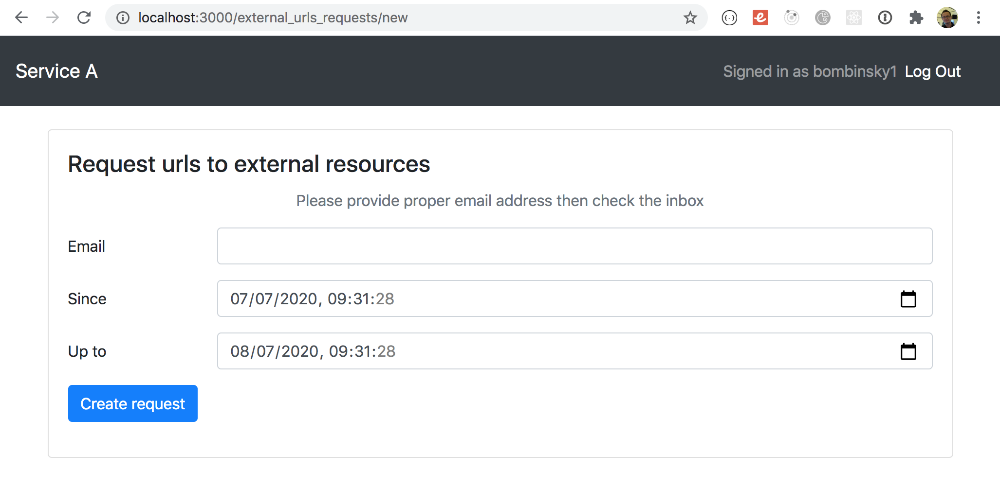
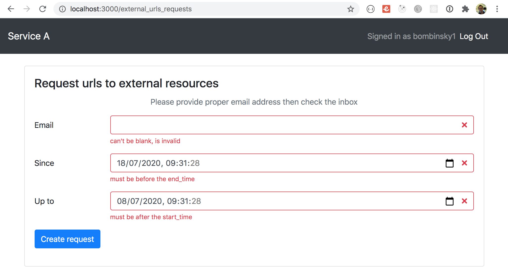
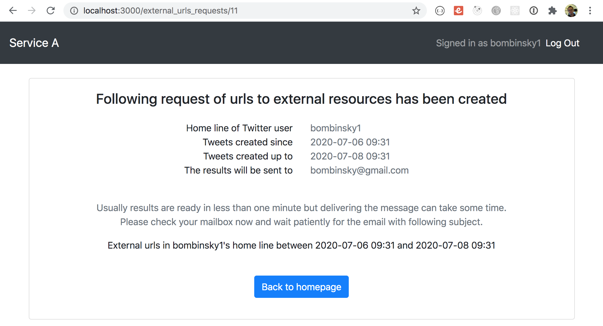
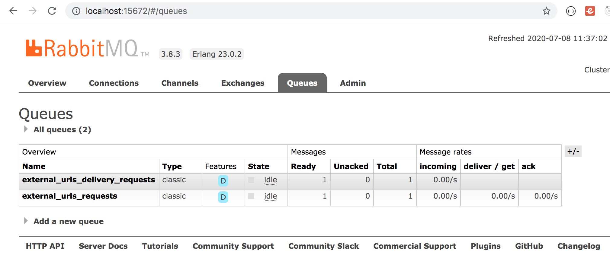
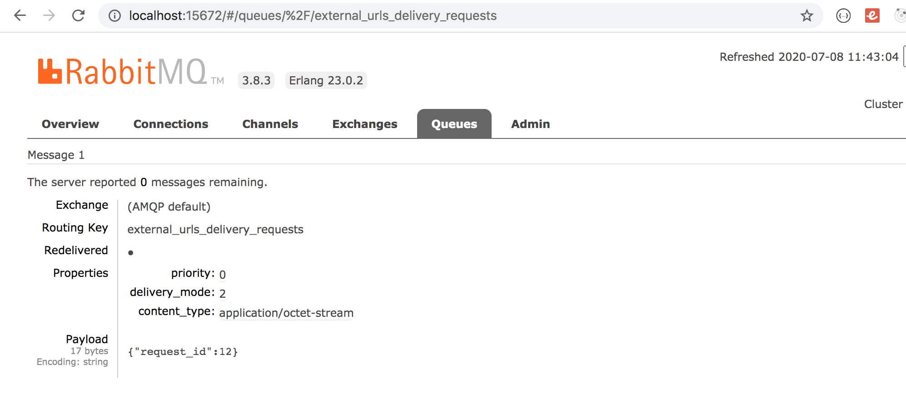
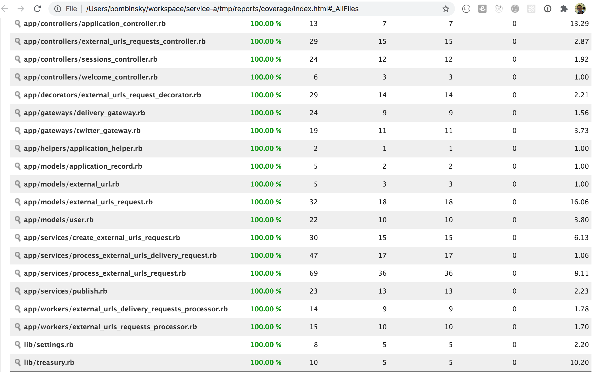
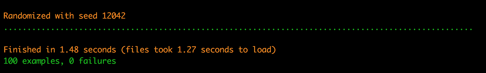

# Service A

This is a repository with few simple pages allowing to parse your twitter homeline in search of urls to external resources. 

## Required environmental variables

Twitter App credentials 
``` 
TWITTER_CONSUMER_KEY=provide_value_for_your_twitter_app
TWITTER_CONSUMER_SECRET=provide_value_for_your_twitter_app
```
Connection to AMQP for background jobs processing
``` 
BUNNY_AMQP_ADDRESSES=localhost:5672
BUNNY_AMQP_USER=guest
BUNNY_AMQP_PASSWORD=guest
BUNNY_AMQP_VHOST=/
BUNNY_CONTINUATION_TIMEOUT=10_000
``` 
Connection to service responsible for email delivery
``` 
SERVICE_B_URL=localhost:3001
SERVICE_B_BASIC_AUTH_USERNAME=service_b
SERVICE_B_BASIC_AUTH_PASSWORD=service_b
``` 

## Simple running instruction until docker files will be ready

1. Set all required environmental variables the way you prefer. For example you can copy then edit .env using .env.example

    ``` cp .env.example .env ```

2. Setup connection for postgres. You can copy then edit config/database.yml using config/database.yml.example

   ``` cp config/database.yml.example cp config/database.yml ```

3. Install and run RabbitMQ server depends on your operating system. OSX for example :

    ``` https://www.rabbitmq.com/install-homebrew.html ```

4. Run application server
  
    ``` rails s```

5. Running background workers

    ``` WORKERS=ExternalUrlsRequestsProcessor,ExternalUrlsDeliveryRequestsProcessor rake sneakers:run ```


## Other commands useful during development

1. Run specs 

    ``` rspec ```

2. Run specs with code coverage

    ``` COVERAGE=true rspec ```
    ``` open tmp/reports/coverage/index.html ```

3. Launch console if needed

    ``` rails c ```

4. Check new code with cops during development

    ``` pronto run -r=flay rails_best_practices reek rubocop brakeman -c origin/develop ```

5. Run pronto with cops on whole code like 
    
    ```pronto run --commit=$(git log --pretty=format:%H | tail -1)```


## Some screenshots for those who would like to skip application setup :) 

#### Login page
<p>
  
</p>

#### Welcome page
<p>
  
</p>


#### External urls request form
<p>
  
</p>

#### Invalid external urls request
<p>
  
</p>

#### External urls request details
<p>
  
</p>

#### Queues in RabbitMQ 
<p>
  
</p>

#### Enqueued message in RabbitMQ
<p>
  
</p>

#### Code coverage report
<p>
  
</p>

#### Rspec output
<p>
  
</p>
